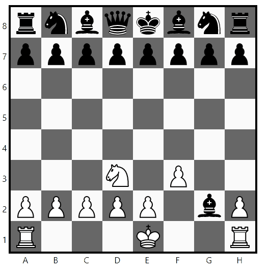

# Readme

DEMO



- This is a chess game, using react
- Almost fully funcional, Play locally with your friends
- There are some issues with the castle move

To run this project you must:

1. Clone this repository

    ```bash
    git clone https://github.com/samuelegea/chess_frontend/
    ```

2. Install react-scripts to download node_modules

    ```bash
    yarn add react-scripts
    ```

3. Start project

    ```bash
    yarn add react-scripts
    ```

4. Enjoy!
